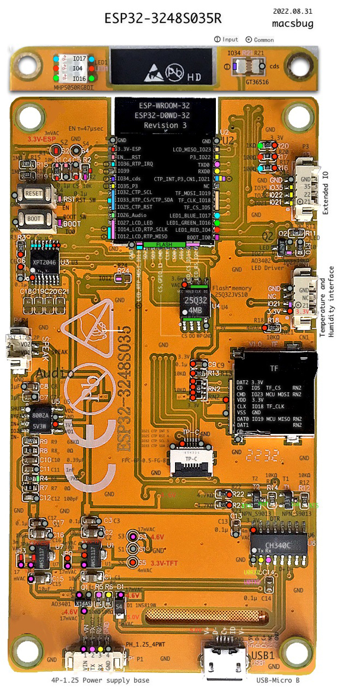
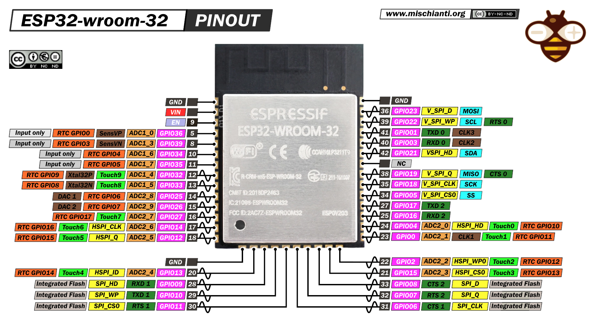

# ESP32-3248S035

#### [ESP-WROOM-32 datasheet (EN)](docs/esp32-wroom-32_datasheet_en.pdf)

This repository contains a barebones board support package (BSP) for the Sunton ESP32-3248S035(C) with a minimal API that supports all onboard peripherals:

|Peripheral|Interface|
|:--------:|:--------|
|LCD (ST7796)|SPI|
|Capacitive touch (GT911)|I²C|
|Audio amplifier|PWM|
|RGB LED|PWM|
|Photoresistor|ADC|

The LCD graphics and touch support are provided directly by [lvgl](https://github.com/lvgl/lvgl) version 9.0. To minimize dependencies and overhead, it drives the SoC peripherals directly instead of using intermediate driver libraries (e.g., TFT_eSPI or LoyvanGFX).

[Example projects](examples) exist for PlatformIO. It uses the `arduino` framework and `espressif32` platform, so it should be trivial to use in either of those environments.

## Layout

The following image is sourced from [macsbug](https://macsbug.wordpress.com/2022/10/02/esp32-3248s035/). Note this image is taken of the board variant with resistive touch (XPT2046) instead of capacitive touch (GT911). 

Some of the notable differences I've observed between resistive and capacitive touch variants:

|Symbol|Resistive (pictured, unsupported)|Capacitive (supported)|
|:----:|:-------------------------------:|:--------------------:|
| `U3` |     XPT2046 resistive touch     |     Unpopulated      |
| `U4` |          4MB SPI flash          |     Unpopulated      |
|`CN1.3` |    Not connected (`NC`)       |        IO22          |

## Pinout 

The following table summarizes GPIO functionality. Note that this **does not** convey all constraints or restrictions. [Refer to the datasheet](docs/esp32-wroom-32_datasheet_en.pdf) before assuming a pin is available.

| GPIO | Input | Output | Strapping | Function |
|:------:|:-----:|:------:|:-----:|:---------|
| 0  | ☒ | ☒ | ☒ | ADC2_CH1, TOUCH1, RTC_GPIO11, CLK_OUT1, EMAC_TX_CLK |
| 1  | ⚠ | ⚠ | ☐ | U0TXD, CLK_OUT3, EMAC_RXD2 |
| 2  | ☒ | ☒ | ☒ | ADC2_CH2, TOUCH2, RTC_GPIO12, HSPIWP, HS2_DATA0, SD_DATA0 |
| 3  | ⚠ | ⚠ | ☐ | U0RXD, CLK_OUT2 |
| 4  | ☒ | ☒ | ☐ | ADC2_CH0, TOUCH0, RTC_GPIO10, HSPIHD, HS2_DATA1, SD_DATA1, EMAC_TX_ER |
| 5  | ☒ | ☒ | ☒ | VSPICS0, HS1_DATA6, EMAC_RX_CLK |
| 6  | ⚠ | ⚠ | ☐ | SD_CLK, SPICLK, HS1_CLK, U1CTS |
| 7  | ⚠ | ⚠ | ☐ | SD_DATA0, SPIQ, HS1_DATA0, U2RTS |
| 8  | ⚠ | ⚠ | ☐ | SD_DATA1, SPID, HS1_DATA1, U2CTS |
| 9  | ⚠ | ⚠ | ☐ | SD_DATA2, SPIHD, HS1_DATA2, U1RXD |
| 10 | ⚠ | ⚠ | ☐ | SD_DATA3, SPIWP, HS1_DATA3, U1TXD |
| 11 | ⚠ | ⚠ | ☐ | SD_CMD, SPICS0, HS1_CMD, U1RTS |
| 12 | ☒ | ☒ | ☒ | ADC2_CH5, TOUCH5, RTC_GPIO15, MTDI, HSPIQ, HS2_DATA2, SD_DATA2, EMAX_TXD3 |
| 13 | ☒ | ☒ | ☐ | ADC2_CH4, TOUCH4, RTC_GPIO14, MTCK, HSPID, HS2_DATA3, SD_DATA3, EMAX_RX_ER |
| 14 | ☒ | ☒ | ☐ | ADC2_CH6, TOUCH6, RTC_GPIO16, MTMS, HSPICLK, HS2_CLK, SD_CLK, EMAC_TXD2 |
| 15 | ☒ | ☒ | ☒ | ADC2_CH3, TOUCH3, MTDO, HSPICS0, RTC_GPIO13, HS2_CMD, SD_CMD, EMAC_RXD3 |
| 16 | ☒ | ☒ | ☐ | HS1_DATA4, U2RXD, EMAC_CLK_OUT |
| 17 | ☒ | ☒ | ☐ | HS1_DATA5, U2TXD, EMAC_CLK_OUT_180 |
| 18 | ☒ | ☒ | ☐ | VSPICLK, HS1_DATA7 |
| 19 | ☒ | ☒ | ☐ | VSPIQ, U0CTS, EMAC_TXD0 |
| 21 | ☒ | ☒ | ☐ | VSPIHD, EMAC_TX_EN |
| 22 | ☒ | ☒ | ☐ | VSPIWP, U0RTS, EMAC_TXD1 |
| 23 | ☒ | ☒ | ☐ | VSPID, HS1_STROBE |
| 25 | ☒ | ☒ | ☐ | DAC_1, ADC2_CH8, RTC_GPIO6, EMAC_RX_D0 |
| 26 | ☒ | ☒ | ☐ | DAC_2, ADC2_CH9, RTC_GPIO7, EMAC_RX_D1 |
| 27 | ☒ | ☒ | ☐ | ADC2_CH7, TOUCH7, RTC_GPIO17, EMAC_RX_DV |
| 32 | ☒ | ☒ | ☐ | XTAL_32K_P (32.768 kHz crystal input), ADC1_CH4, TOUCH9, RTC_GPIO9 |
| 33 | ☒ | ☒ | ☐ | XTAL_32K_N (32.768 kHz crystal output), ADC1_CH5, TOUCH8, RTC_GPIO8 |
| 34 | ☒ | ☐ | ☐ | ADC1_CH6, RTC_GPIO4 |
| 35 | ☒ | ☐ | ☐ | ADC1_CH7, RTC_GPIO5 |
| 36 | ☒ | ☐ | ☐ | ADC1_CH0, RTC_GPIO0 |
| 39 | ☒ | ☐ | ☐ | ADC1_CH3, RTC_GPIO3 |
